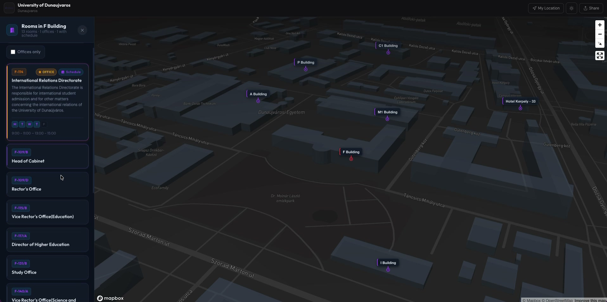
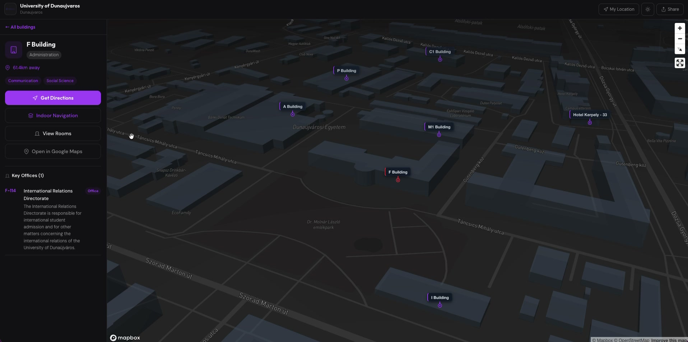
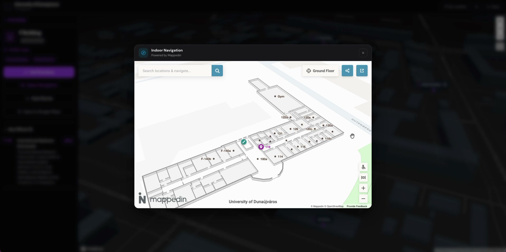
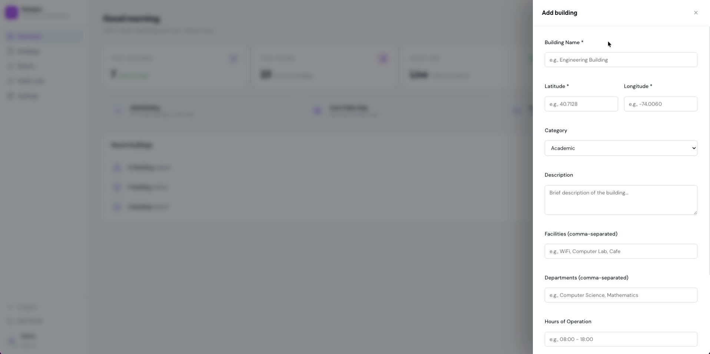
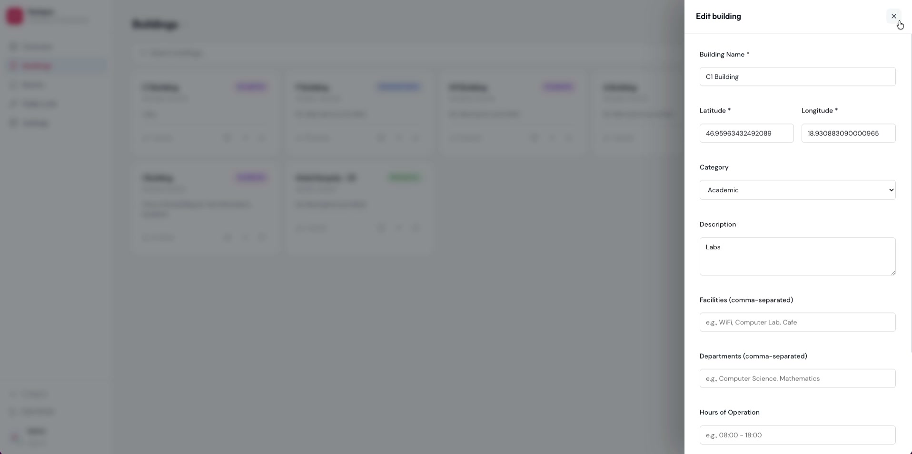

# Campus Explorer — University 3D Mapping Platform

An open-source interactive 3D campus map platform for universities. Students can explore buildings, find rooms, view timetables, and navigate indoors — no app required.

**[Live Demo](https://3dcampus.vercel.app)** | **[Issues](https://github.com/BTAG16/3D-University/issues)**


[](https://vercel.com/new/clone?repository-url=https://github.com/BTAG16/3D-University)



---

## Features

### For Students
- Interactive 3D campus map with all buildings labelled
- Click any building to see rooms, offices, and schedules
- Turn-by-turn directions to any building
- Indoor floor plan navigation (powered by Mappedin)
- Dark mode





### For Admins
- Dashboard to manage buildings, rooms, and schedules
- One-click public link, QR code, and embeddable iframe
- Custom branding (accent colour, welcome message, logo)
- Usage analytics and cookie consent controls
- Multi-tenant — one platform, multiple universities





---

## Tech Stack

| Layer | Technology |
|---|---|
| Frontend | React 19, Vite, Framer Motion |
| Map | Mapbox GL JS v3 |
| Indoor navigation | Mappedin (optional) |
| Backend | Supabase (Postgres + Auth + Edge Functions) |
| Email | Resend |
| Deploy | Vercel |

---

## Quick Start

### 1. Clone and install

```bash
git clone https://github.com/BTAG16/3D-University.git
cd 3D-University
yarn install
cp .env.example .env
```

### 2. Set up services

Follow these guides in order:

1. [Supabase setup](docs/setup-supabase.md) — database, auth, and edge functions
2. [Mapbox setup](docs/setup-mapbox.md) — map tiles and access token
3. [Resend setup](docs/setup-resend.md) — transactional email for super admin login codes
4. [Deploy to Vercel](docs/deploy-vercel.md) — hosting, environment variables, and production branch
5. [First-Time Setup](docs/first-time-setup.md) — create your admin account, add buildings, go live

### 3. Run locally

```bash
yarn dev
```

Open [http://localhost:5173](http://localhost:5173).

---

## Environment Variables

| Variable | Required | Description |
|---|---|---|
| `VITE_SUPABASE_URL` | Yes | Supabase project URL |
| `VITE_SUPABASE_ANON_KEY` | Yes | Supabase anon key |
| `VITE_MAPBOX_ACCESS_TOKEN` | Yes | Mapbox public token |
| `VITE_SUPER_ADMIN_EMAIL` | Yes | Email address that receives super admin login codes |
| `VITE_CONTACT_EMAIL` | Yes | Contact email shown in Privacy Policy and Terms |

See [`.env.example`](.env.example) for the full list with descriptions.

---

## Documentation

| Guide | Description |
|---|---|
| [Supabase Setup](docs/setup-supabase.md) | Create the database, configure auth, deploy edge functions |
| [Mapbox Setup](docs/setup-mapbox.md) | Get a Mapbox token and configure map access |
| [Resend Setup](docs/setup-resend.md) | Set up transactional email for super admin OTP codes |
| [Deploy to Vercel](docs/deploy-vercel.md) | Deploy the frontend, set env vars, configure production branch |
| [First-Time Setup](docs/first-time-setup.md) | Create your first university, add buildings, share with students |

---

## Contributing

Contributions are welcome.

1. Fork the repo
2. Create a branch (`git checkout -b feature/your-feature`)
3. Commit your changes
4. Open a Pull Request

If adding data collection features, include GDPR compliance considerations in your PR description.

---

## License

MIT — see [LICENSE](./LICENSE).

---

## Acknowledgments

- [Mapbox](https://www.mapbox.com/) for the mapping platform
- [Mappedin](https://www.mappedin.com/) for indoor navigation
- [Supabase](https://supabase.com/) for backend infrastructure
- [Vite](https://vitejs.dev/) and [React](https://react.dev/) for the frontend
- [Framer Motion](https://www.framer.com/motion/) for animations
- [Resend](https://resend.com/) for transactional email
